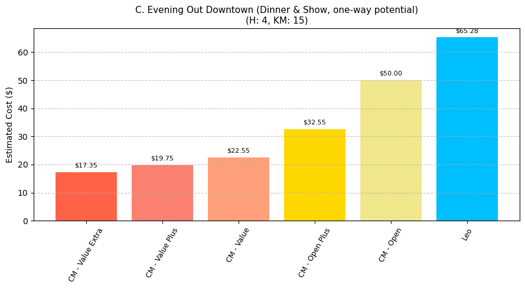

# Share a Car, Not Your Savings! Navigating Leo vs. Communauto Prices in Québec 🚗💸

Thinking about car sharing in Québec? Smart move! Services like Leo Autopartage and Communauto can be wallet-friendly alternatives to owning a car. But which one offers the best bang for your buck on your typical trips?

It's not a one-size-fits-all answer. Their pricing is as different as choosing between a pay-as-you-go phone plan and one with a monthly bundle. We've done the homework, running countless trip simulations with our own analysis tool, to help you decide.

*(Friendly heads-up: Prices and plans can change! Always check official sources. Our examples exclude taxes.)*

---

## Meet the Players: Leo & Communauto

*   **Leo Autopartage is like your friendly neighborhood "scoop shop":**
    *   Pay for what you use (time & distance).
    *   No monthly membership fees.
    *   A small fixed "service fee" (access + insurance) per trip – like paying for the cone.
    *   Generous kilometers often included with hourly/daily rentals!

*   **Communauto is like an "all-you-can-eat buffet" with different entry passes:**
    *   Multiple "plans": Some free to join (like "Open"), others with monthly/yearly fees (like "Value" plans) for cheaper per-trip rates.
    *   Some plans require a refundable deposit.
    *   **Two car types:**
        *   **Round-Trip:** Book for a set time from a station.
        *   **FLEX:** One-way, grab-and-go in a zone. Pricing cleverly picks the best deal for you between its own FLEX rate or your plan's rate (with a few rules).

---

## At a Glance: Leo vs. Communauto Showdown

| Feature                 | Leo Autopartage                      | Communauto (General - Varies by Plan) |
| :---------------------- | :----------------------------------- | :------------------------------------ |
| **Subscription Fee**    | None                                 | Free (Open) to ~$30/month (Value Extra) |
| **Per-Trip Fixed Fees** | Yes (Access + Insurance)             | Generally No                          |
| **Time Billing**        | Per-minute, auto-bundles to forfaits | Hourly rates, daily maximums          |
| **KM Included (Sub-Day)**| Typically 75km with forfaits         | Varies: 75km (Open, FLEX) or 0km (others pay per km) |
| **Weekend Surcharges**  | No                                   | Yes (most plans for time)             |
| **One-Way Trips**       | Yes (standard)                       | Yes (with FLEX vehicles)              |
| **Special Rates**       | N/A                                  | Yes (Long Distance, Workday on select plans) |
| **Best for Road Trips?**| Possible                             | Often Yes (Value plans' Long Distance Rate) |

*(Communauto's details differ a lot between plans!)*

---

## Key Price Factors: Time, Distance, & Fees

### 🍦 Time: How Long's the Ride?

*   **Leo:** Per-minute, but often auto-upgrades to cheaper hourly/daily "packages."
*   **Communauto:** Plan-specific hourly rates & daily maximums. Weekends often have a small time surcharge.

**Quick Take:** For ultra-short hops, Communauto FLEX can be great. For all-day use (low KM), Communauto's Value plan daily caps are strong.

---

### 🚗 Kilometers: How Far You Roam?

*   **Leo:** Often includes 75km for sub-day trips (or per day for longer ones). Simple flat rate for extra KMs.
*   **Communauto:** It's a mixed bag! "Open" & FLEX include 75km. Other plans charge per KM differently. "Value" plans boast a "Road Trip Superpower" (Long Distance Rate) and "Value Extra" has a "Weekday Warrior Perk" (Workday Rate).

**Quick Take:** Under 75km? Leo's inclusion is handy. Big road trip? Communauto Value plans are your go-to.

---

### 🎫 Subscriptions & Extras: The Upfront Costs

*   **Leo:** That small per-trip service fee. No monthly subscription.
*   **Communauto:** Most plans have monthly/yearly fees ("Open" is free). Some need a refundable deposit.

**Quick Take:** Rarely drive? Leo's "no subscription" is tempting. Regular user? A Communauto subscription might save more on trips overall.

---

## Montreal Scenarios: Who's Cheaper When?

Let's see how they stack up for common city trips. (Our analysis tool helped us here!)

**(Embed your bar chart images below each scenario!)**

### 1. The "Plateau Coffee & Bagels" Run ☕🥯
*   **Trip:** 1.5-hour weekend morning, ~8 km, using a FLEX car.

*   **Insight:** **Communauto FLEX** often edges out Leo for these quick, spontaneous trips due to efficient per-minute billing and avoiding Leo's fixed per-trip fee.

---

### 2. The "Weekday IKEA Adventure" 🛋️📦
*   **Trip:** 3.5 hours on a weekday, ~25 km round trip, needing a car for that block of time (Round-Trip booking).

*   **Insight:** With time being more critical than distance here, **Communauto's Value plans** frequently offer better value due to their lower hourly rates.

---

### 3. "Evening Out Downtown (One-Way Potential)" 🌃🎭
*   **Trip:** ~4 hours for a weekend evening out, ~15 km, potentially using a FLEX car one-way.

*   **Insight:** This is where it gets interesting! If your **Communauto plan** has a low hourly rate, the "4-hour minimum plan rate" for a FLEX trip can be competitive. Otherwise, **Leo's** forfait system for 4 hours might be simpler and cheaper than some Communauto FLEX calculations.

---

## Don't Forget Membership Costs!

If you're eyeing Communauto, remember those plan fees. For occasional trips, Leo or Communauto's free "Open" plan might be best. For regulars, a paid Communauto plan's per-trip savings can quickly outweigh its subscription cost.

*(Example: Communauto "Open" is $0/year, "Value Extra" is around $30/month.)*

---

## How We Crunched the Numbers

Curious about our insights? We built a price calculator that simulated thousands of trips using all official Leo and Communauto rules. This allowed us to see patterns and identify when each service typically offers better value, rather than just guessing!

---

## The Bottom Line: Your Best Bet?

1.  **Know Your Trips:** How often, how long, how far? Weekends or weekdays?
2.  **Occasional User?** **Leo** or **Communauto's free "Open" plan** are strong contenders.
3.  **Regular User?** See if per-trip savings on a **paid Communauto plan** justify its subscription. For road trips, **Communauto "Value" plans** are often unbeatable.

Choosing wisely means more cash for poutine and less for parking! Happy (and smart) driving!

## Want to Dive Deeper?

For those interested in the technical details or wishing to perform their own custom comparisons, the complete analysis, including all Python code and the underlying pricing models, is available on [GitHub](https://www.github.com/Cloudsky01/communauto-vs-leo). Feel free to explore, fork, or contribute!